# Analysis of treatment effects on growth, yield and quality parameters of strawberry plants using R

## 1. Problem Statement

In this experiment, strawberry plants were given various nutrient and biostimulant treatments that influenced plant growth, flowering behavior, yield and fruit quality. In experimental horticulture, large datasets are often collected across replications and plants, but:

- Data are commonly stored in complex, multi-sheet Excel workbooks  
- Manual or spreadsheet-based analysis increases the risk of errors  
- Identifying the best-performing treatment across multiple traits is difficult  
- Reproducible and transparent statistical workflows are often lacking  

### Research Problem

**How can experimental strawberry data be transformed into a reproducible, statistically sound analysis pipeline that objectively identifies the best treatments for growth, yield and quality traits?**

---

## 2. Objectives of the Project

The objectives of this project were:

1. To convert raw experimental Excel data into a clean and analyzable format  
2. To explore treatment-wise variability using exploratory data analysis (EDA)  
3. To test treatment effects statistically using ANOVA  
4. To identify significant differences using post-hoc testing  
5. To summarize results in an automated and objective manner  
6. To demonstrate strong R programming and statistical skills suitable for PhD-level research  

---

## 3. Experimental Data Description

- **Crop:** Strawberry (*Fragaria × ananassa*)  
- **Experimental design:** One-factor experiment (Treatment)  
- **Number of treatments:** 9 (T1–T9)  
- **Replications:** 3 to 4  
- **Observations:** Plant-level measurements  

### Treatment details

- **T1:** 0.5% ZnSO₄  
- **T2:** 0.2% Borax  
- **T3:** 1% KNO₃  
- **T4:** 0.2% Humic Acid  
- **T5:** 0.2% Seaweed Extract  
- **T6:** 0.5% ZnSO₄ + 0.2% Humic Acid + 0.2% Seaweed Extract  
- **T7:** 0.2% Borax + 0.2% Humic Acid + 0.2% Seaweed Extract  
- **T8:** 1% KNO₃ + 0.2% Humic Acid + 0.2% Seaweed Extract  
- **T9:** Control  

### Traits analyzed

- Plant spread (cm)  
- Number of leaves  
- Crown diameter (mm)  
- Days to first flowering  
- Total flowers per plant  
- Days to first harvest  
- Fruit length (mm)  
- Fruit breadth (mm)  

Missing observations were present for some replications and were handled using `NA`-aware statistical methods rather than data deletion.

---

## 4. Methodology

### 4.1 Data Cleaning and Structuring

- Raw Excel worksheets were merged into a single tidy dataset  
- Each row represents one plant within one replication and treatment  
- Missing values were retained as `NA`  
- The cleaned dataset was exported as `master_data_clean.csv`  

This ensured transparency, reproducibility and traceability of all analyses.

---

### 4.2 Exploratory Data Analysis (EDA)

EDA was conducted to understand:

- Distribution of traits across treatments  
- Biological variability among plants  
- Presence of outliers  
- Overall treatment-wise trends  

For each trait, the following visualizations were created:

- **Boxplots** to examine distribution, variability and outliers  
- **Mean ± Standard Error bar plots** to compare treatments  

Mean ± SE plots were used as they are standard in agronomy and horticulture research for treatment comparison.

---

### 4.3 Statistical Analysis

#### Analysis of Variance (ANOVA)

- One-way ANOVA was performed for each trait using treatment as the factor  
- Statistical significance was tested at α = 0.05  

#### Post-hoc Testing

- Tukey’s Honest Significant Difference (HSD) test was applied  
- Pairwise treatment comparisons were conducted while controlling family-wise error  

---

### 4.4 Results Summarization

An R script was developed to:

- Extract ANOVA p-values for all traits  
- Identify traits with statistically significant treatment effects  
- Compute treatment-wise means  
- Select the best-performing treatment based on mean values  

The output was consolidated into a single summary table (`results_summary.csv`), which provides a clear overview of treatment performance across growth, yield and quality traits.

Biological interpretation (e.g., earlier flowering indicated by fewer days) was applied during result interpretation.

---

## 5. Results

### 5.1 Summary of Treatment Performance

| Trait | Best Treatment | Significant |
|------|---------------|------------|
| Total flowers | T8 (1% KNO₃ + Humic Acid + Seaweed Extract) | Yes |
| Fruit length | T3 (1% KNO₃) | Yes |
| Fruit breadth | T3 (1% KNO₃) | Yes |
| Number of leaves | T1 (0.5% ZnSO₄) | Yes |
| Days to first flowering | T5 (0.2% Seaweed Extract) | Yes |
| Days to first harvest | T5 (0.2% Seaweed Extract) | Yes |
| Plant spread | — | No |
| Crown diameter | — | No |

---

### 5.2 Interpretation of Results

- **T8 (1% KNO₃ + Humic Acid + Seaweed Extract)** showed superior performance for the primary yield trait (total number of flowers).  
- **T3 (1% KNO₃)** consistently produced fruits with superior size, indicating better fruit quality.  
- **T5 (0.2% Seaweed Extract)** resulted in the earliest flowering and harvesting, highlighting its role in crop earliness.  
- **T1 (0.5% ZnSO₄)** promoted vegetative growth as indicated by a higher number of leaves.  
- **Plant spread and crown diameter** did not differ significantly among treatments, suggesting relative stability of these traits under the experimental conditions.

---

### 5.3 Visualization of Trait Responses

#### Growth Traits

**Plant Spread**

<table>
  <tr>
    <td align="center">
      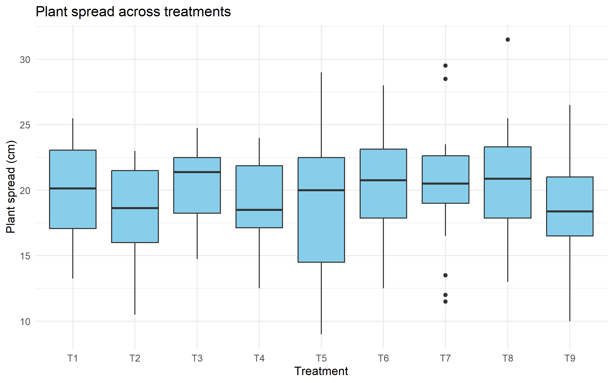
       Boxplot
    </td>
    <td align="center">
      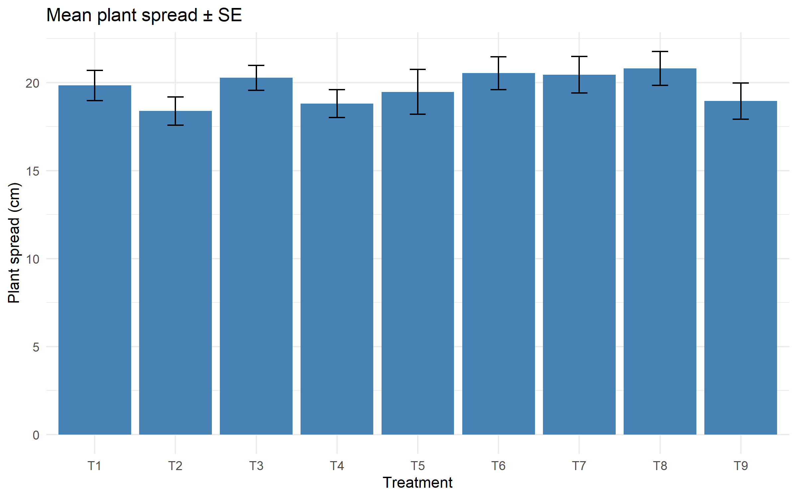
       Mean ± SE
    </td>
  </tr>
</table>

**Number of Leaves**

<table>
  <tr>
    <td align="center">
      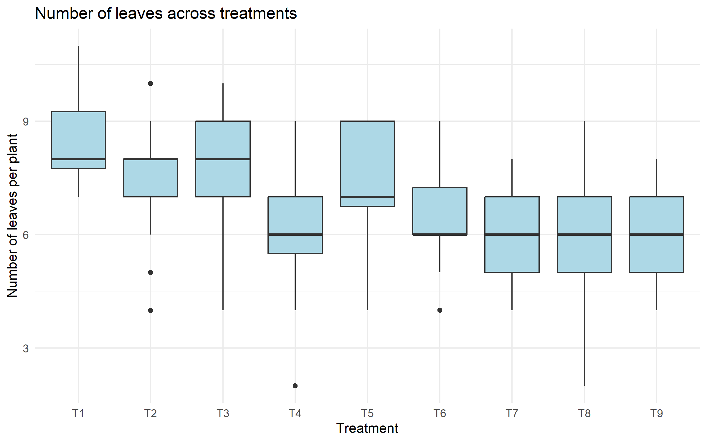
       Boxplot
    </td>
    <td align="center">
      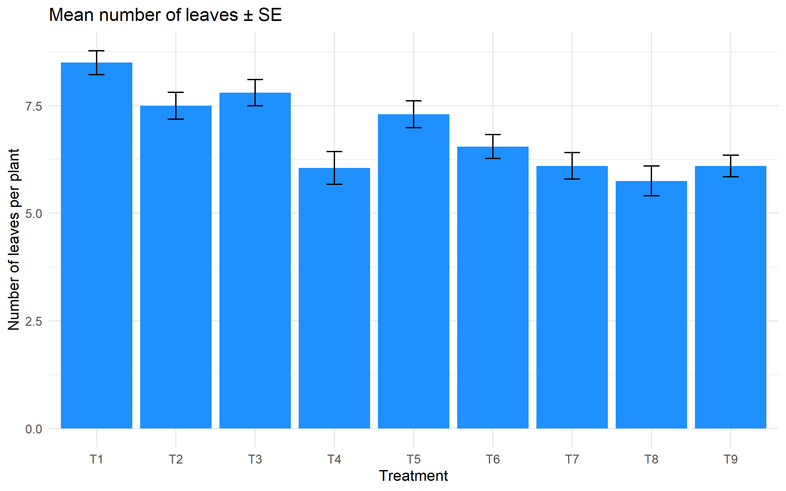
       Mean ± SE
    </td>
  </tr>
</table>

**Crown Diameter**

<table>
  <tr>
    <td align="center">
      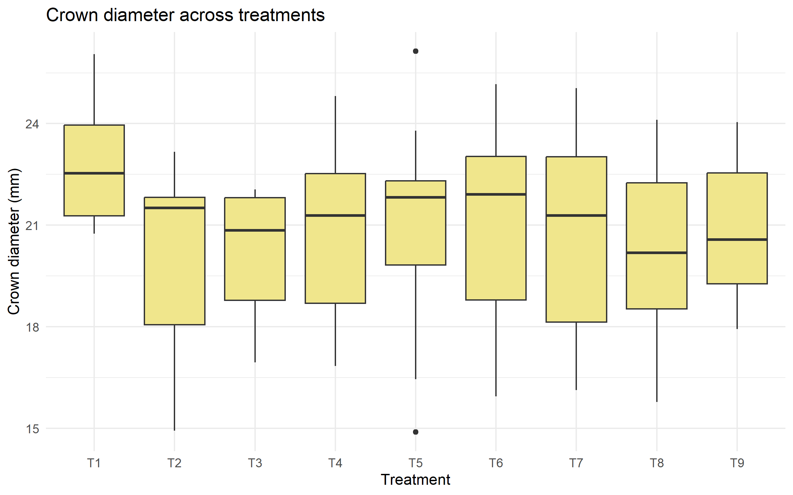
       Boxplot
    </td>
    <td align="center">
      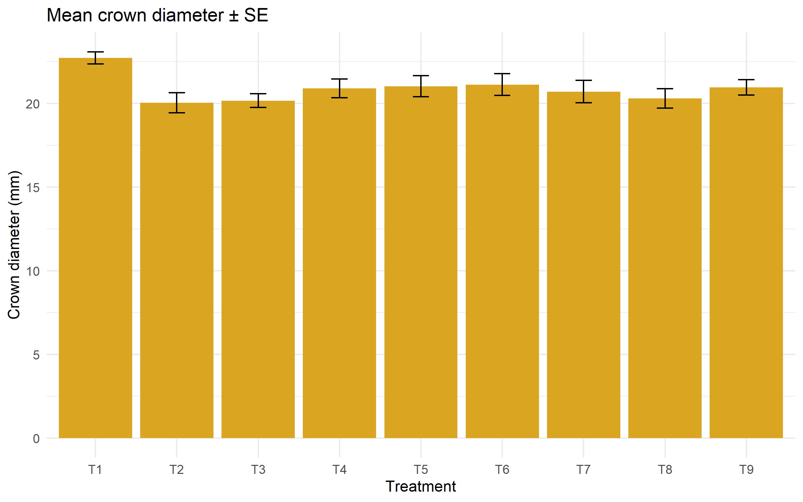
       Mean ± SE
    </td>
  </tr>
</table>

---

#### Yield Traits

**Total Flowers**

<table>
  <tr>
    <td align="center">
      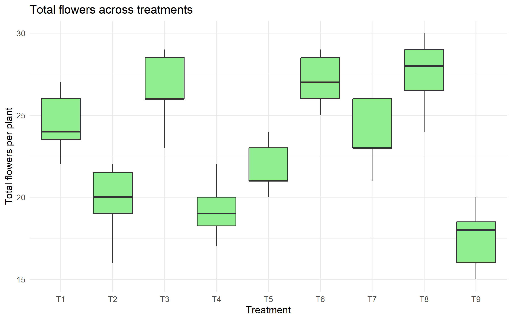
       Boxplot
    </td>
    <td align="center">
      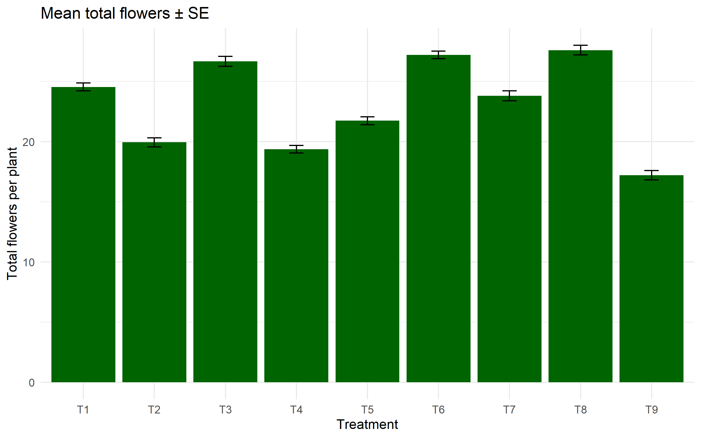
       Mean ± SE
    </td>
  </tr>
</table>

**Days to First Flowering**

<table>
  <tr>
    <td align="center">
      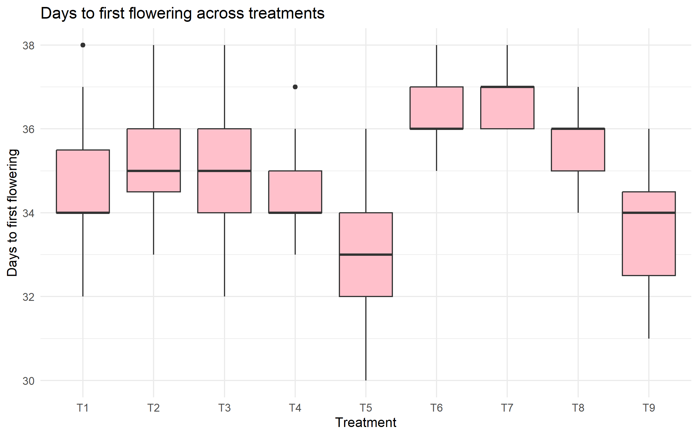
       Boxplot
    </td>
    <td align="center">
      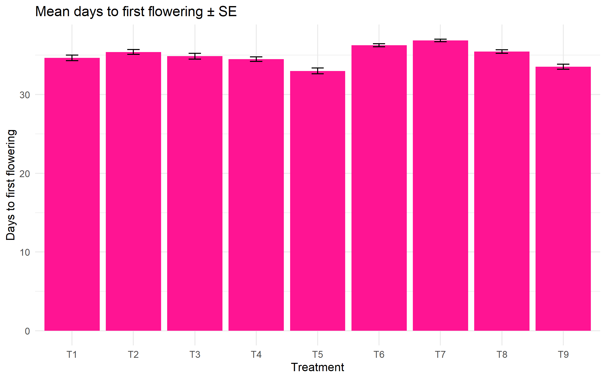
       Mean ± SE
    </td>
  </tr>
</table>

**Days to First Harvest**

<table>
  <tr>
    <td align="center">
      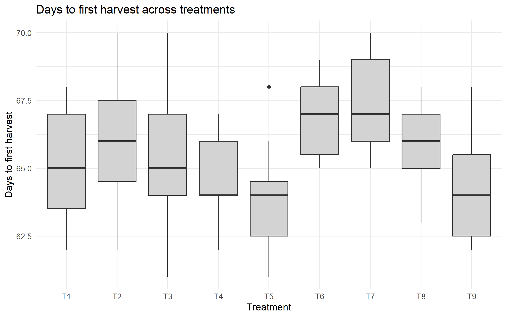
       Boxplot
    </td>
    <td align="center">
      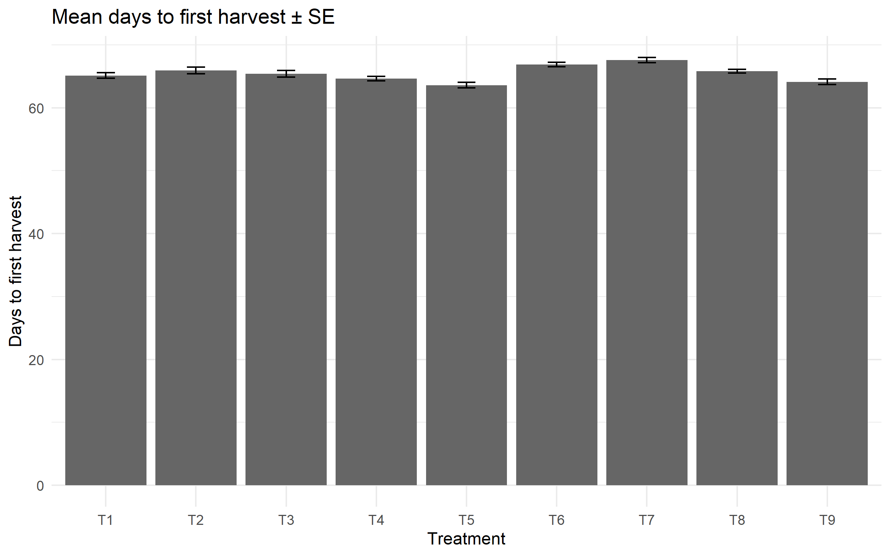
       Mean ± SE
    </td>
  </tr>
</table>

---

#### Quality Traits

**Fruit Length**

<table>
  <tr>
    <td align="center">
      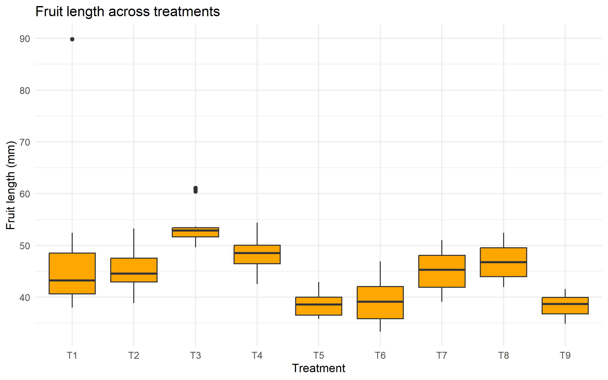
       Boxplot
    </td>
    <td align="center">
      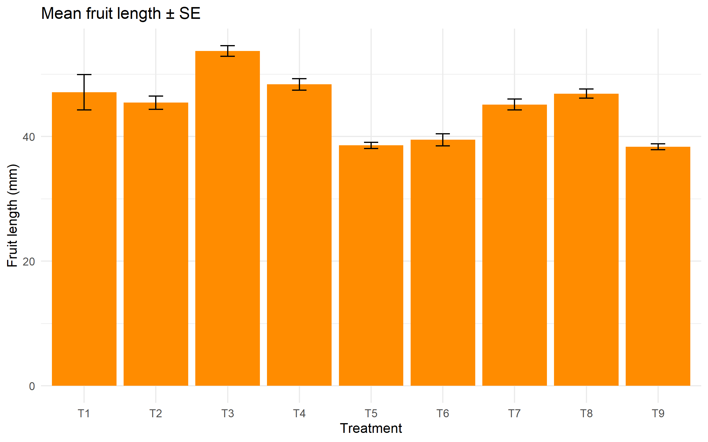
       Mean ± SE
    </td>
  </tr>
</table>

**Fruit Breadth**

<table>
  <tr>
    <td align="center">
      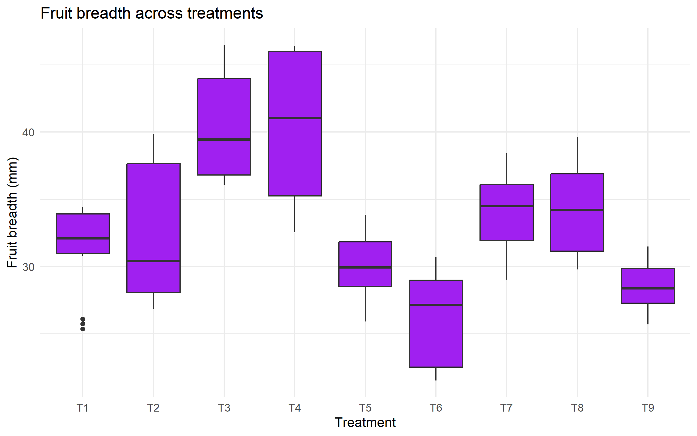
       Boxplot
    </td>
    <td align="center">
      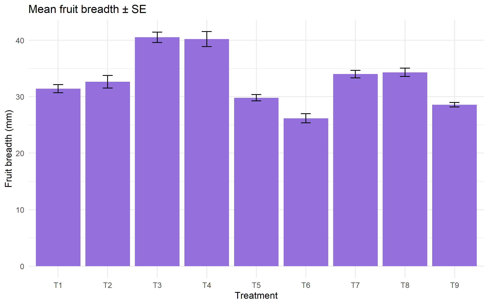
       Mean ± SE
    </td>
  </tr>
</table>

---

## 6. Discussion

The results indicate that no single treatment was optimal for all traits. Distinct trade-offs were observed between:

- Vegetative growth  
- Yield potential  
- Fruit quality  
- Earliness  

---

## 7. Conclusion

This project demonstrates how:

- Raw experimental horticultural data can be transformed into a clean, analyzable format  
- Exploratory and inferential statistics can be combined in a reproducible workflow  
- R can be used as a complete tool for experimental data analysis and interpretation  

The analytical framework developed in this study can be applied to other agricultural and horticultural experiments.

---

## 8. Tools and Technologies Used

- R  
- tidyverse packages (`dplyr`, `ggplot2`, `readr`)  
- Statistical methods: ANOVA, Tukey HSD  
- Version control: GitHub  
